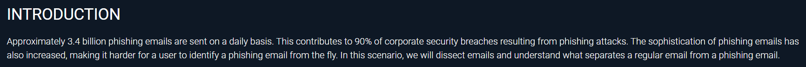
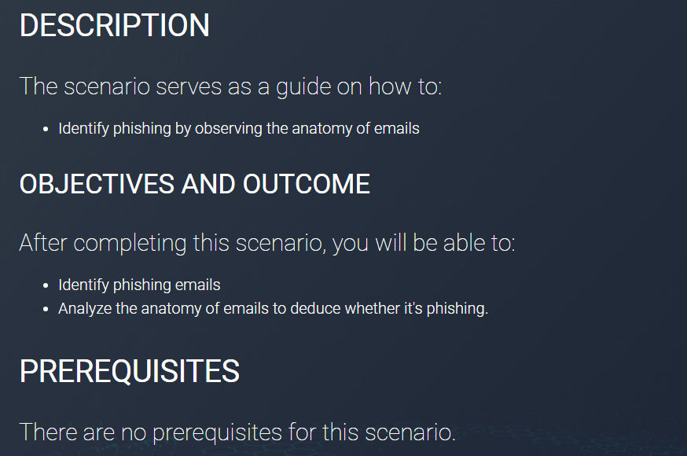

# 🛡️ Anatomy of a Phishing Email – Transport Cyrus

  
  
  
  

This repository contains **notes, labs, scripts, case studies, docs, extras, screenshots, and a certificate of attendance** for the *Anatomy of a Phishing Email – Transport Cyrus* program.  
The course focuses on **email transport, phishing techniques, spoofing, link/attachment analysis, campaign tracking, and defense measures**.

---

## 📚 Notes
- 📄 [01-overview.md](./notes/01-overview.md) – Overview & email structure  
- 📄 [02-email-headers.md](./notes/02-email-headers.md) – Deep dive into email headers  
- 📄 [03-smtp-transport.md](./notes/03-smtp-transport.md) – SMTP transport analysis  
- 📄 [04-mime-and-attachments.md](./notes/04-mime-and-attachments.md) – MIME & attachment breakdown  
- 📄 [05-spoofing-and-phishing-techniques.md](./notes/05-spoofing-and-phishing-techniques.md) – Spoofing and phishing tactics  
- 📄 [06-link-analysis.md](./notes/06-link-analysis.md) – Link analysis & redirection chains  
- 📄 [07-malicious-attachment-analysis.md](./notes/07-malicious-attachment-analysis.md) – Malicious attachments analysis  
- 📄 [08-opsec-and-attribution.md](./notes/08-opsec-and-attribution.md) – OPSEC & attribution considerations

---

## 🧪 Labs
- 🔧 [phishing-campaign-labs.md](./labs/phishing-campaign-labs.md) – Phishing campaign labs  
- 🔧 [email-defense-and-forensics.md](./labs/email-defense-and-forensics.md) – Email defense & forensics labs  
- 🔧 [hands-on-exercises.md](./labs/hands-on-exercises.md) – Hands-on exercises

---

## ⚡ Scripts
- 💻 [README.md](./scripts/README.md) — scripts folder overview  
- 💻 [expand_url.py](./scripts/expand_url.py) — Expand & resolve shortened URLs (use in isolated env)  
- 💻 [extract_attachments.sh](./scripts/extract_attachments.sh) — Extract MIME attachments from `.eml`  
- 💻 [headers_to_json.py](./scripts/headers_to_json.py) — Convert raw headers to JSON  
- 💻 [mailparser_extractor.py](./scripts/mailparser_extractor.py) — Extract headers/body/attachments with Python  
- 💻 [generate_hashes.sh](./scripts/generate_hashes.sh) — Generate MD5/SHA1/SHA256 for files  
- 💻 [yara_scan.py](./scripts/yara_scan.py) — Run YARA rules against a directory

---

## 📋 Extras
- 📑 [case-studies.md](./extras/case-studies.md) — Real-world phishing campaign analyses  
- 📑 [resources.md](./extras/resources.md) — Tools, reading, and feeds  
- 📑 [timeline.md](./extras/timeline.md) — Suggested course timeline & milestones

---

## 📖 Docs
- 📘 [index.md](./docs/index.md) — Program overview  
- 📘 [syllabus.md](./docs/syllabus.md) — Course syllabus  
- 📘 [roadmap.md](./docs/roadmap.md) — Learning roadmap  
- 📘 [references.md](./docs/references.md) — External references & RFCs  
- 📘 [glossary.md](./docs/glossary.md) — Key terms & definitions

---

## 📸 Screenshots

| Step | Screenshot |
|------|------------|
| 📚 Course Overview |  |
| 🧭 Course Diagram / Promotion |  |

---

## 📜 Certificate
🎓 `ngvu.thdanh-Anatomy-of-a-phishing-email-Transport-Certificate-of-attendance-CYRUS.pdf`  
(placed under `cert/` as `ngvu.thdanh-Anatomy-of-a-phishing-email-Transport-Certificate-of-attendance-CYRUS.pdf`)

---

## ✍️ Personal Review
This learning package provides a focused, practical approach to **email security and phishing forensics**.  
It covers both technical artifacts (headers, SMTP behavior, MIME, malicious attachments) and operational workflows (campaign mapping, OPSEC, reporting).  
Labs and scripts are designed to let learners practice safely in isolated environments.

---

## ✍️ Author
**Thành Danh** – Red Team Learner & Security Researcher

- GitHub: [@ngvuthdanhh](https://github.com/ngvuthdanhh)  
- Email: ngvu.thdanh@gmail.com

---

## 📄 License
This project is licensed under the terms of the **MIT License**. See [LICENSE](./LICENSE) for full details.  
© 2025 ngvuthdanhh. All rights reserved.
